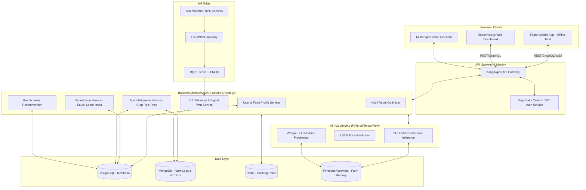

# SmartFarm AI System Architecture

This document describes the high-level architecture for **SmartFarm AI**, a highly scalable, offline-first agricultural operating system integrating IoT, AI, marketplace, and rural logistics.

## High-Level Component Diagram

## Technology Stack

### Frontend
- **Mobile**: Flutter (Dart) with `sqflite` for local caching and offline-first capabilities.
- **Web**: React (Next.js) with Tailwind CSS and Redux Toolkit.

### Backend Microservices
- **Core APIs (Marketplace, Users)**: Node.js (Express/NestJS) or Python (FastAPI).
- **AI & Data Heavy Services**: Python (FastAPI).
- **Routing**: Python (with NetworkX/OSRM integration).

### AI & Machine Learning
- **Computer Vision**: PyTorch, YOLOv8 (Pest, Disease, Deficiency detection).
- **Time-Series Prediction**: TensorFlow/Keras LSTM (Mandi prices).
- **Voice AI**: OpenAI Whisper (Speech-to-text), multilingual LLM prompt chains (LangChain/LlamaIndex).
- **Geospatial Processing**: PostGIS, GeoPandas.

### Databases
- **PostgreSQL**: Users, Locations, Marketplaces, Financial Transactions, Routes.
- **MongoDB**: Schema-less farm logs, massive IoT telemetry, historical weather.
- **Redis**: Real-time mandi price caching, active sessions, API rate-limiting.
- **Vector DB (Pinecone/Weaviate)**: Farm Memory System (semantic search over disease histories, voice queries).

### DevOps & Cloud
- **Cloud Agnostic**: EKS/GKE/AKS.
- **Containerization**: Docker.
- **Orchestration**: Kubernetes with Helm.
- **CI/CD**: GitHub Actions or GitLab CI.

## Offline-First Strategy
The mobile application (Flutter) uses a Local-First architecture:
1. **Local DB**: SQLite stores user profile, downloaded scheme details, and latest cached prices.
2. **On-Device ML**: Lightweight TFLite models for pest detection when internet is completely down.
3. **Optimistic UI**: Form submissions (like labor requests or equipment booking) are saved locally and pushed via a background queue (`workmanager`) when the connection is restored.
